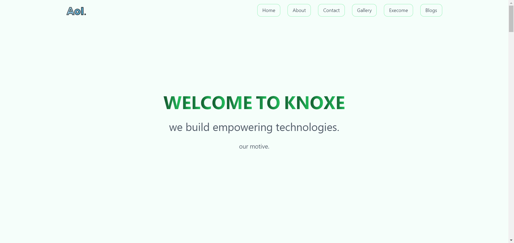

# Web Knox ✨

Web Knox is a modern, responsive website developed using Next.js and Tailwind CSS. This project showcases a clean, minimalistic design with smooth scrolling and intuitive navigation.

## Table of Contents

- [Demo](#demo)
- [Features](#features)
- [Screenshot](#screenshot)
- [Installation](#installation)
- [Usage](#usage)
- [Contributing](#contributing)
- [License](#license)

## Demo

Check out the live demo [here](https://web-knox.vercel.app/).

## Features

- 📱 **Responsive Design:** Adapts to different screen sizes for a seamless user experience on any device.
- 🧭 **Smooth Scrolling:** Implemented using Framer Motion for a fluid navigation experience.
- 🎨 **Modern UI:** Clean and minimalistic design using Tailwind CSS for fast styling and customization.
- 🔍 **SEO Optimized:** Built with SEO best practices to ensure better search engine visibility.
- 🖼️ **Gallery Page:** Showcases images with a visually appealing layout.
- 📞 **Contact Us Page:** Allows users to get in touch via a contact form.
- 📝 **Blog Page:** Contains articles and blog posts with easy navigation.

## Screenshot



## Installation

To get a local copy up and running, follow these steps:

1. **Clone the repository:**
   ```bash
   git clone https://github.com/aceknoxe/web-knox.git
   cd web-knox
   ```

2. **Install dependencies:**
   ```bash
   npm install
   ```

3. **Run the development server:**
   ```bash
   npm run dev
   ```

   Open [http://localhost:3000](http://localhost:3000) with your browser to see the result.

## Usage

This project can be used as a template for creating modern websites with Next.js and Tailwind CSS. You can customize the components and styles to fit your needs.

## Contributing

Contributions are welcome! Please follow these steps to contribute:

1. Fork the repository.
2. Create a new branch (`git checkout -b feature/new-feature`).
3. Make your changes and commit them (`git commit -m 'Add some feature'`).
4. Push to the branch (`git push origin feature/new-feature`).
5. Open a pull request.

## License

This project is licensed under the MIT License.

## Hosting
This project is hosted on Vercel free tier. To deploy your own version, follow these steps:
1. Sign up on [Vercel](https://vercel.com) and link your GitHub repository.
2. Click "New Project" and import the web-knox repository.
3. Follow the deployment instructions provided by Vercel. 

## Give Us a Star ⭐

If you like this project, please give us a star on [GitHub](https://github.com/aceknoxe/web-knox)! ⭐

